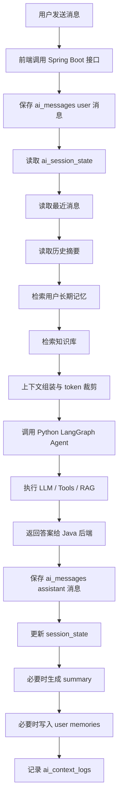

# AiTrader AI 对话上下文管理方案规划与技术选型

## 1. 文档目标

本文档用于为 `AiTrader` 项目设计一套可落地的 AI 对话上下文管理方案，目标是：

- 让 AI 对话具备稳定的多轮连续性
- 支持用户长期记忆、会话状态和知识检索
- 兼容当前项目的前端、Java 后端和 Python Agent 三层结构
- 为后续策略分析、投顾问答、知识问答、报告生成提供统一基础设施

## 2. 项目现状分析

### 2.1 当前技术结构

项目当前已经具备三层架构：

- 前端：`React 19 + TypeScript + Vite + Capacitor`
- 业务后端：`Spring Boot 3 + MyBatis + MySQL + Redis`
- AI 服务：`FastAPI + LangGraph + LangChain + Redis`

当前调用链路为：

```text
React Web / App
    -> Spring Boot API
    -> Python LangGraph Agent
    -> LLM / RAG / Market Tools
```

### 2.2 当前已具备能力

- 前端已具备 AI 聊天入口与独立服务层
- Java 后端已具备 Agent 网关能力，可统一转发到 Python 服务
- Python Agent 已支持 `chat`、`rag`、`tools`、`strategy mode`
- 项目已接入 `Redis`
- 项目已存在 RAG 相关基础模块，可继续扩展为统一知识与记忆检索层

### 2.3 当前问题与机会

从现有代码形态看，项目已经完成了 AI 调用链路的基础打通，但上下文管理仍处于较轻量阶段，主要表现为：

- 对话历史主要依赖请求时传入，缺少统一持久化标准
- 缺少结构化的 `session state`，流程型对话容易依赖模型自行推断
- 缺少用户长期记忆层，用户偏好与项目背景难以复用
- RAG 已有基础能力，但尚未和会话上下文、记忆层统一编排
- 缺少可观测的上下文组装日志，线上排查回答偏差成本较高

因此，本方案的重点不是重写现有架构，而是在现有三层基础上补齐 `上下文基础设施层`。

## 3. 方案设计目标

### 3.1 业务目标

- 支持 AI 多轮连续对话，不轻易丢失上下文
- 支持用户长期偏好记忆，例如语言、风格、关注市场、风险偏好
- 支持交易策略问答、报告生成、知识问答三类核心场景
- 支持 Web 与移动端共享同一套会话能力

### 3.2 技术目标

- 支持短期上下文、历史摘要、长期记忆、知识检索分层管理
- 支持按 token 预算动态裁剪上下文
- 支持从 Java 后端统一控制会话与权限
- 支持 Python Agent 聚合工具调用与 RAG
- 支持后续平滑升级为更多 Agent 或多图编排

## 4. 目标架构

### 4.1 推荐架构

```text
用户消息
  -> 前端 AIChat
  -> Java 后端会话网关
  -> 上下文编排服务
      -> 最近消息读取
      -> 会话状态读取
      -> 历史摘要读取
      -> 用户长期记忆检索
      -> 知识库检索
  -> Python LangGraph Agent
      -> LLM 推理
      -> 工具调用
      -> RAG 查询
  -> 返回结果
  -> 回写消息 / 摘要 / 记忆 / 日志
```

### 4.2 分层模型

建议将上下文拆成五层：

- `短期上下文层`：最近 6 到 12 轮消息，保证当前对话连贯
- `摘要层`：对更早消息做阶段性压缩，降低 token 消耗
- `记忆层`：保存用户稳定信息、长期目标和约束条件
- `知识层`：保存策略知识、交易术语、产品文档和平台规则
- `状态层`：保存当前会话任务、步骤、已确认参数和最近工具结果

### 4.3 为什么适合当前项目

这套设计贴合 `AiTrader` 的原因在于：

- Java 后端已经适合做统一网关、鉴权、会话和数据存储
- Python Agent 已经适合做推理、工具和 LangGraph 编排
- Redis 已在项目中使用，适合作为缓存、短期状态和部分向量能力承载
- 后续若做策略报告、市场分析、KYC 引导、用户画像，都需要结构化上下文能力

## 5. 技术选型建议

### 5.1 总体结论

建议采用 `MySQL + Redis + Python RAG/Embedding + Java 会话网关` 的渐进式方案，而不是一次性引入过多新中间件。

### 5.2 选型表

| 模块 | 当前基础 | 推荐选型 | 说明 |
| --- | --- | --- | --- |
| 前端会话界面 | React + TS | 保持现状 | 前端负责展示，不负责复杂上下文存储 |
| API 网关 | Spring Boot | 保持现状 | 统一鉴权、用户识别、会话归属和审计 |
| 会话主存储 | MySQL | 保持 MySQL | 已与当前后端一致，适合消息、摘要、记忆元数据 |
| 缓存与短状态 | Redis | 保持 Redis | 保存最近上下文缓存、状态缓存、召回结果缓存 |
| Agent 编排 | LangGraph | 保持现状 | 适合工具调用、ReAct、策略模式 |
| 向量能力 | Redis Vector 或后续 pgvector/Qdrant | 第一阶段继续 Redis，第二阶段再评估 | 当前依赖已包含 Redis 方向，改造成本低 |
| Embedding 生成 | Python 服务 | 放在 `ai-agent-service` | 便于统一和 RAG 流程集成 |
| 摘要生成 | Python Agent | 放在 `ai-agent-service` | 复用现有模型调用能力 |
| 监控日志 | MySQL + 应用日志 | 第一阶段够用 | 后续可接 ELK 或 OpenTelemetry |

### 5.3 为什么不建议现在切 PostgreSQL

虽然 `PostgreSQL + pgvector` 对 AI 项目很友好，但当前项目后端已明显以 `MySQL + MyBatis` 为主，直接切换数据库会增加较大迁移成本，包括：

- Java 数据层改造成本高
- 现有业务表可能已基于 MySQL 设计
- 团队调试与部署路径会被拉长

因此建议：

- 第一阶段继续使用 `MySQL + Redis`
- 第二阶段如果向量检索规模变大，再评估 `Qdrant` 或 `pgvector`

## 6. 数据模型设计

### 6.1 核心表设计

建议新增以下核心表：

#### 1. `ai_conversations`

用于管理会话基本信息。

建议字段：

- `id`
- `user_id`
- `title`
- `scene_type`
- `status`
- `last_message_at`
- `created_at`
- `updated_at`

说明：

- `scene_type` 用于区分 `chat`、`strategy`、`rag`、`advisor`
- 一名用户可以拥有多个会话

#### 2. `ai_messages`

用于保存原始对话消息。

建议字段：

- `id`
- `conversation_id`
- `role`
- `content`
- `message_index`
- `token_count`
- `tool_name`
- `tool_result`
- `created_at`

说明：

- `role` 支持 `system`、`user`、`assistant`、`tool`
- 工具调用消息建议也记录，便于调试 Agent 行为

#### 3. `ai_conversation_summaries`

用于保存历史摘要。

建议字段：

- `id`
- `conversation_id`
- `start_message_index`
- `end_message_index`
- `summary_text`
- `summary_type`
- `created_at`

说明：

- `summary_type` 可区分 `rolling`、`milestone`
- 历史摘要只覆盖旧消息，最近消息仍保留原文

#### 4. `ai_session_state`

用于保存当前会话状态。

建议字段：

- `id`
- `conversation_id`
- `current_intent`
- `current_mode`
- `current_step`
- `state_json`
- `updated_at`

说明：

- `state_json` 建议保存为 JSON 字符串
- 适合保存策略报告阶段、已确认参数、待确认问题、最近工具结果

#### 5. `ai_user_memories`

用于保存用户长期记忆。

建议字段：

- `id`
- `user_id`
- `memory_type`
- `content`
- `importance_score`
- `source`
- `is_active`
- `last_used_at`
- `created_at`
- `updated_at`

说明：

- `memory_type` 可取 `preference`、`goal`、`constraint`、`profile`、`project_context`
- 只存稳定、高复用信息，不存一次性闲聊

#### 6. `ai_knowledge_chunks`

用于保存知识切片。

建议字段：

- `id`
- `doc_id`
- `title`
- `source`
- `chunk_index`
- `chunk_text`
- `embedding_ref`
- `created_at`

说明：

- 若第一阶段向量存 Redis，可用 `embedding_ref` 存 Redis key
- 后续切向量数据库时可平滑迁移

#### 7. `ai_context_logs`

用于记录每次上下文组装结果。

建议字段：

- `id`
- `conversation_id`
- `user_message_id`
- `used_recent_count`
- `used_summary_ids`
- `used_memory_ids`
- `used_knowledge_ids`
- `prompt_token_estimate`
- `response_token_estimate`
- `created_at`

说明：

- 这张表非常重要，能帮助排查“为什么这次回答不对”

## 7. 调用流程设计

### 7.1 标准流程



### 7.2 上下文拼装顺序

建议固定如下优先级：

1. `system prompt`
2. `session state`
3. `最近消息`
4. `历史摘要`
5. `长期记忆`
6. `知识片段`
7. `当前用户输入`

说明：

- `session state` 优先级应高于摘要和知识
- 历史摘要用于补足长期上下文，但不应覆盖最近消息
- 召回知识片段数量要受 token 预算约束

### 7.3 上下文裁剪规则

当 token 接近上限时，建议按以下顺序裁剪：

1. 删除低相关知识片段
2. 删除较旧的最近消息
3. 只保留最新摘要
4. 保留高优先级长期记忆

不应裁剪的内容：

- 当前用户输入
- 系统规则
- 当前会话状态
- 强约束信息，例如风险偏好、用户身份、策略模式

## 8. 场景适配设计

### 8.1 普通 AI 问答

适用于：

- 行情问答
- 基础策略问答
- 产品帮助

上下文策略：

- 最近 8 到 10 条消息
- 读取最近摘要
- 检索 3 到 5 条长期记忆
- 检索 3 到 5 条知识片段

### 8.2 策略报告模式

适用于：

- 生成某币种或策略的完整分析报告
- 汇总市场数据、新闻、技术指标并输出结构化内容

上下文策略：

- `current_mode = strategy`
- 在 `session_state` 中保存当前策略参数
- 对最近工具调用结果做结构化缓存
- 对报告生成链路单独保留 `summary_type = milestone`

### 8.3 流程引导型对话

适用于：

- 用户开户引导
- 风险评估问卷
- KYC 流程

上下文策略：

- 以 `session_state` 为核心
- 历史消息只做参考
- 所有关键字段写入 `state_json`
- 每次回复前优先检查未完成槽位

## 9. 模块职责划分

### 9.1 前端职责

- 展示消息列表、加载状态、失败重试
- 持有当前 `conversationId`
- 在切会话时拉取历史消息
- 不在前端做复杂记忆管理

### 9.2 Spring Boot 职责

- 鉴权、用户识别、会话归属控制
- 提供标准 AI 会话 API
- 负责消息、会话、摘要、记忆元数据落库
- 负责上下文编排入口
- 统一调用 Python Agent 服务

### 9.3 Python Agent 职责

- 承担 LangGraph 工作流与推理
- 执行工具调用
- 执行 RAG 召回
- 执行摘要生成、记忆提取和必要的重排序

### 9.4 Redis 职责

- 缓存最近会话上下文
- 缓存 session state 热数据
- 缓存知识检索结果
- 第一阶段承载轻量向量能力或 embedding 索引引用

## 10. API 规划建议

建议在 Java 后端新增统一 AI 会话接口，而不是让前端直接拼历史。

### 10.1 建议接口

#### `POST /api/ai/conversations`

创建新会话。

#### `GET /api/ai/conversations`

获取用户会话列表。

#### `GET /api/ai/conversations/{id}/messages`

获取某会话历史消息。

#### `POST /api/ai/conversations/{id}/chat`

发送消息并获取 AI 回复。

请求示例：

```json
{
  "message": "帮我分析 BTC 近 24 小时走势",
  "mode": "chat"
}
```

#### `POST /api/ai/conversations/{id}/strategy`

触发策略模式对话或报告生成。

#### `GET /api/ai/conversations/{id}/state`

读取当前会话状态。

#### `POST /api/ai/knowledge/upload`

上传知识文档。

### 10.2 为什么建议这样拆

- 前端逻辑更简单
- Java 后端更容易统一安全和权限
- Python Agent 专注推理，不直接承担业务会话归属
- 后续更容易接入埋点、审计和用户画像

## 11. 上下文管理实现建议

### 11.1 摘要策略

建议规则：

- 每累计 12 到 20 条消息生成一次滚动摘要
- 最近 6 条消息始终保留原文
- 对策略报告类会话，在关键节点额外生成里程碑摘要

摘要建议包含：

- 当前讨论主题
- 已确认事实
- 未确认问题
- 已执行工具和关键结果
- 用户显式偏好与限制

### 11.2 记忆写入策略

建议仅写入以下内容：

- 用户偏好，例如语言、输出风格、关注市场
- 长期项目背景，例如量化交易、策略研究
- 稳定约束，例如只用中文、关注美股或加密货币
- 会影响未来回答的稳定信息

不建议写入：

- 一次性情绪表达
- 未经确认的模型推断
- 短时失效的细节
- 纯聊天寒暄

### 11.3 检索策略

推荐组合：

- 规则检索：读取最近消息、最新摘要、当前会话状态
- 向量检索：召回长期记忆和知识片段
- 重排序：按相关性和重要性评分筛选进入 prompt 的内容

## 12. 分阶段落地计划

### 第一阶段：打通标准会话能力

目标：

- 建立消息、会话、状态的统一存储
- 由 Java 后端统一对接 Python Agent
- 支持最近消息 + 状态拼装

范围：

- 新增 `ai_conversations`
- 新增 `ai_messages`
- 新增 `ai_session_state`
- 提供统一会话接口

预期结果：

- 解决基本多轮对话问题
- 前端不再直接承担历史拼接责任

### 第二阶段：补齐摘要与长期记忆

目标：

- 控制 token 成本
- 让 AI 能记住稳定偏好和项目背景

范围：

- 新增 `ai_conversation_summaries`
- 新增 `ai_user_memories`
- 新增摘要生成任务
- 新增长期记忆提取与写入

预期结果：

- 会话更稳
- 旧历史不会无限膨胀

### 第三阶段：统一 RAG 与上下文编排

目标：

- 让知识召回和对话上下文形成统一入口
- 提升策略问答、报告生成的准确性

范围：

- 新增 `ai_knowledge_chunks`
- 新增 `ai_context_logs`
- 增加向量召回与缓存
- 增加召回质量监控

预期结果：

- 回答更专业
- 可排查、可优化

## 13. 风险与规避建议

### 13.1 主要风险

- 上下文过长导致成本高、延迟高
- 记忆写入过多导致回答污染
- 知识召回不准导致答非所问
- Java 与 Python 的职责边界不清导致维护成本上升

### 13.2 规避方式

- 严格限制每次注入 prompt 的消息和知识数量
- 对长期记忆增加审核和重要性评分
- 为每次上下文组装记录日志
- 将“业务存储”和“模型推理”分层，避免互相侵入

## 14. 最终推荐结论

结合当前 `AiTrader` 项目现状，推荐采用以下路线：

- 前端继续保持 `React + TypeScript + Capacitor`
- Java 后端继续作为统一业务网关和会话存储中心
- Python `LangGraph` 服务继续作为 Agent 推理与工具执行中心
- 数据存储第一阶段保持 `MySQL + Redis`
- 向量能力第一阶段基于现有 Redis 思路落地，第二阶段按规模评估升级
- 先完成 `消息 + 状态 + 摘要`，再补 `长期记忆 + 统一 RAG`

这是对当前项目成本、现有技术栈和后续扩展性最平衡的方案。

## 15. 下一步实施建议

建议按以下顺序推进：

1. 在 Java 后端新增 AI 会话相关表和 API
2. 将当前 AI 聊天入口统一改为 `conversationId` 模式
3. 在 Python Agent 增加摘要生成与记忆提取能力
4. 将 RAG 召回结果纳入统一上下文组装流程
5. 增加 `ai_context_logs`，提升可观测性

如果继续推进实现，下一份文档建议补充：

- 详细建表 SQL
- Java 实体与 Mapper 设计
- Python 端 `Context Builder` 伪代码
- 前端会话页面交互时序图
