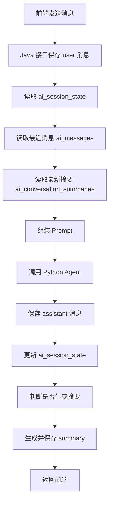

# AiTrader 第一阶段实施方案：消息 + 状态 + 摘要

## 1. 文档目标

本文档用于指导 `AiTrader` 项目完成 AI 上下文管理的第一阶段建设，重点实现三项基础能力：

- `消息`：保存每轮原始对话
- `状态`：保存当前会话的结构化进度
- `摘要`：压缩旧历史，降低上下文长度和成本

该阶段的目标是先完成最小闭环，让 AI 会话具备可持续、多轮、可恢复的上下文能力，而不是一次性引入长期记忆和复杂 RAG。

## 2. 适用范围

本方案适用于当前项目已有的三层结构：

- 前端：`React + TypeScript + Vite + Capacitor`
- 业务后端：`Spring Boot + MyBatis + MySQL + Redis`
- AI 服务：`FastAPI + LangGraph`

第一阶段不依赖新中间件，不强制引入向量数据库，尽量复用现有栈。

## 3. 这一阶段要解决什么问题

当前系统虽然已经具备 AI 调用链路，但还存在以下典型问题：

- 对话历史主要依赖请求时传入，刷新或切端后上下文容易断
- 流程型对话缺少结构化状态，模型容易忘记“进行到哪一步”
- 历史对话越积越长，token 消耗越来越高
- Java 后端和 Python Agent 之间缺少统一的会话上下文协议

第一阶段的核心目标是解决：

1. 原始消息持久化
2. 当前会话状态结构化
3. 历史摘要自动生成
4. 对话上下文由后端统一组装

## 4. 第一阶段的交付结果

完成本阶段后，系统应具备以下能力：

- 用户刷新页面或重进 App 后仍可继续当前会话
- 前端不再负责拼历史，后端统一管理上下文
- AI 能记住本次会话里已确认的关键参数
- 旧消息会被压缩成摘要，不再无限进入 prompt
- 策略问答、普通聊天、流程引导都可以复用同一套会话框架

## 5. 方案边界

本阶段明确不做以下内容：

- 不做用户长期记忆
- 不做统一知识库召回
- 不做复杂向量检索
- 不做多 Agent 编排扩展
- 不做自动纠错闭环

这样可以把复杂度压在可控范围内，优先先把基础会话能力做稳。

## 6. 核心设计思路

### 6.1 三层上下文结构

第一阶段的上下文仅由三部分组成：

- `最近消息`：保留最近 6 到 10 条原始消息
- `会话状态`：保存当前任务、参数和步骤
- `历史摘要`：保存更早消息的压缩结果

每次调用模型时，按如下顺序组装：

1. 系统提示词
2. 当前 `session_state`
3. 最近消息
4. 历史摘要
5. 当前用户输入

### 6.2 设计原则

- 原始事实永远以 `messages` 为准
- 当前任务进度永远以 `session_state` 为准
- 历史上下文压缩永远以 `summaries` 为准
- 前端只负责会话展示，后端负责上下文拼装

## 7. 数据模型设计

第一阶段建议最少建设 4 张表。

### 7.1 `ai_conversations`

用于表示一段独立会话。

建议字段：

- `id`
- `user_id`
- `title`
- `scene_type`
- `status`
- `last_message_at`
- `created_at`
- `updated_at`

字段说明：

- `scene_type` 推荐支持 `chat`、`strategy`、`advisor`
- `status` 推荐支持 `active`、`archived`

用途：

- 前端基于 `conversationId` 进入会话
- 一个用户可持有多段 AI 会话

### 7.2 `ai_messages`

用于保存每轮原始消息。

建议字段：

- `id`
- `conversation_id`
- `role`
- `content`
- `message_index`
- `token_count`
- `created_at`

字段说明：

- `role` 建议支持 `system`、`user`、`assistant`、`tool`
- `message_index` 用于确保会话内顺序稳定
- `token_count` 初期可选，后续有助于裁剪

用途：

- 保存完整原始对话
- 作为摘要生成与回放的基础数据源

### 7.3 `ai_session_state`

用于保存当前会话的结构化状态。

建议字段：

- `id`
- `conversation_id`
- `current_intent`
- `current_mode`
- `current_step`
- `state_json`
- `updated_at`

字段说明：

- `current_intent`：当前意图，如 `strategy_analysis`
- `current_mode`：当前模式，如 `chat` 或 `strategy`
- `current_step`：当前步骤，如 `collect_requirements`
- `state_json`：保存灵活状态数据

`state_json` 示例：

```json
{
  "confirmed_slots": {
    "symbol": "BTC",
    "market": "crypto",
    "risk_level": "稳健"
  },
  "pending_slots": [
    "time_horizon"
  ],
  "last_tool_result": {
    "tool": "get_current_price",
    "status": "success"
  }
}
```

### 7.4 `ai_conversation_summaries`

用于保存旧历史的摘要。

建议字段：

- `id`
- `conversation_id`
- `start_message_index`
- `end_message_index`
- `summary_text`
- `summary_type`
- `created_at`

字段说明：

- `summary_type` 推荐支持 `rolling` 和 `milestone`
- `rolling` 用于滚动摘要
- `milestone` 用于策略分析等关键节点摘要

## 8. 核心接口设计

第一阶段建议新增以下 Java 后端接口。

### 8.1 创建会话

`POST /api/ai/conversations`

作用：

- 创建新会话
- 初始化默认 `session_state`

### 8.2 查询消息列表

`GET /api/ai/conversations/{id}/messages`

作用：

- 拉取历史消息用于页面恢复

### 8.3 发送消息并获取 AI 回复

`POST /api/ai/conversations/{id}/chat`

这是第一阶段最核心的接口。

职责：

- 保存用户消息
- 读取最近消息、状态、摘要
- 组装上下文
- 调用 Python Agent
- 保存 AI 回复
- 更新会话状态
- 必要时生成摘要

### 8.4 查询当前状态

`GET /api/ai/conversations/{id}/state`

作用：

- 调试和流程型页面展示
- 供前端理解当前步骤和已确认参数

## 9. 详细调用流程

### 9.1 标准流程图



### 9.2 每一步具体做法

#### 第一步：保存用户消息

收到前端请求后，先写入一条 `user` 消息：

- `conversation_id`
- `role = user`
- `content = 用户输入`
- `message_index = 当前最大序号 + 1`

这样能保证所有用户输入先落库。

#### 第二步：读取当前上下文

从数据库中读取：

- 最近 8 条消息
- 当前会话状态
- 最近 1 条摘要

建议第一版简单处理，不做复杂筛选。

#### 第三步：组装模型输入

建议由 Java 后端统一组装，不让前端自行拼接。

输入内容建议包含：

- 固定系统提示词
- `session_state`
- `latest_summary`
- `recent_messages`
- `current_user_message`

#### 第四步：调用 Python Agent

Java 后端向 Python 发送统一载荷。

建议结构：

```json
{
  "message": "帮我分析一下 BTC",
  "user_id": "123",
  "session_id": "conversation_1001",
  "history": [
    {
      "role": "user",
      "content": "..."
    },
    {
      "role": "assistant",
      "content": "..."
    }
  ],
  "state": {
    "current_mode": "chat",
    "current_step": "collect_requirements",
    "confirmed_slots": {
      "symbol": "BTC"
    }
  },
  "summaries": [
    "用户此前主要讨论 BTC 策略分析，偏向稳健风格。"
  ]
}
```

如果第一版 Python 侧不方便改接口，可以先由 Java 把 `state` 和 `summary` 拼成一段系统上下文文本传过去。

#### 第五步：保存 AI 回复

Python 返回结果后，写入一条 `assistant` 消息。

#### 第六步：更新 `session_state`

根据本轮用户输入和 AI 结果，更新会话状态。

第一阶段推荐两种方式：

- 规则更新
- 模型返回 `state_patch` 后合并

优先推荐先用规则更新，成本更低。

#### 第七步：触发摘要

当消息达到阈值后，对较老的一段消息生成摘要并入库。

## 10. `session_state` 的具体做法

### 10.1 它解决的问题

`session_state` 用来记录“这段会话当前进行到哪了”，避免模型每轮都从消息里重新猜。

### 10.2 推荐保存哪些信息

第一阶段建议只保存最关键字段：

- `current_mode`
- `current_step`
- `current_intent`
- `confirmed_slots`
- `pending_slots`
- `last_tool_result`

### 10.3 推荐状态结构

```json
{
  "current_mode": "strategy",
  "current_intent": "strategy_analysis",
  "current_step": "confirm_parameters",
  "confirmed_slots": {
    "market": "crypto",
    "symbol": "BTC",
    "risk_level": "稳健"
  },
  "pending_slots": [
    "time_horizon"
  ],
  "last_tool_result": {
    "tool": "get_current_price",
    "status": "success"
  }
}
```

### 10.4 怎么更新状态

第一阶段推荐从简单规则开始。

规则示例：

- 命中 `BTC`、`ETH`、`SOL`，更新 `symbol`
- 命中 `稳健`、`保守`，更新 `risk_level = 稳健`
- 命中 `激进`、`高风险`，更新 `risk_level = 进取`
- 命中 `短线`、`中线`、`长线`，更新 `time_horizon`
- 如果当前参数齐全，更新 `current_step = generate_strategy`

后续再逐步引入模型抽取。

## 11. `summary` 的具体做法

### 11.1 为什么需要摘要

如果把全部历史都直接传给模型，会出现：

- token 成本不断增加
- 响应变慢
- 无关历史干扰当前回答

摘要的作用是：

- 用较短文本保留旧历史中的关键信息
- 让最近消息继续保留原文，兼顾完整性和成本

### 11.2 摘要触发规则

推荐第一阶段规则：

- 每累计 12 条消息生成一次摘要
- 最近 6 条消息始终保留原文
- 只摘要更早的消息

例如：

- 当前共有 20 条消息
- 保留最近 6 条原文
- 对前 14 条消息进行摘要

### 11.3 摘要内容建议

摘要应尽量包含：

- 当前讨论主题
- 已确认的关键事实
- 未确认的问题
- 已调用过的关键工具或关键结果
- 当前用户偏好和约束

摘要示例：

```text
用户正在咨询 BTC 策略分析，偏向稳健风格，关注加密市场。已确认标的是 BTC，尚未确认持有周期。此前已讨论当前价格和基础分析，用户希望获得偏实操的建议。
```

### 11.4 摘要生成方式

推荐先用 Python Agent 调用模型生成摘要。

建议的摘要 Prompt 目标：

- 不做泛泛总结
- 只保留后续对话还需要的信息
- 不重复最近消息里的内容

### 11.5 摘要生成时机

第一阶段建议同步触发即可：

- AI 回复完成后
- 判断是否超出阈值
- 如果需要，则立即生成摘要并保存

后续再改成异步任务。

## 12. Prompt 组装方案

第一阶段推荐使用固定模板，保证实现简单和效果稳定。

```text
你是 AiTrader 的 AI 助手。

当前会话状态：
{session_state}

历史摘要：
{latest_summary}

最近对话：
{recent_messages}

用户当前问题：
{current_message}
```

设计原则：

- `session_state` 优先级高于摘要
- 最近消息优先于摘要
- 当前消息必须最后单独出现

## 13. Java 后端实现建议

### 13.1 建议新增模块

建议在 `ai-trader-backend` 中新增：

- `conversation` 相关 DTO / VO
- `AiConversationController`
- `AiConversationService`
- `AiConversationMapper`
- `AiSummaryService`
- `AiSessionStateService`

### 13.2 关键服务职责

`AiConversationService`

- 创建会话
- 保存消息
- 获取最近消息
- 调用 Agent

`AiSessionStateService`

- 初始化会话状态
- 合并状态 patch
- 查询当前状态

`AiSummaryService`

- 判断是否需要生成摘要
- 提取待摘要消息
- 调用 Python 生成摘要
- 保存摘要

## 14. Python Agent 实现建议

### 14.1 第一阶段最小改造

建议在现有 `ChatRequest` 基础上新增两个可选字段：

- `state`
- `summaries`

示例：

```python
class ChatRequest(BaseModel):
    message: str
    user_id: str
    session_id: Optional[str] = None
    history: Optional[List[Dict[str, str]]] = []
    mode: Optional[str] = "chat"
    state: Optional[Dict[str, Any]] = None
    summaries: Optional[List[str]] = []
```

### 14.2 使用方式

在 Python 侧将：

- `summary`
- `state`
- `history`

统一转成模型可理解的上下文消息，再进入 LangGraph。

## 15. 前端改造建议

第一阶段前端只需要完成三件事：

- 进入聊天页时拿到 `conversationId`
- 发送消息时只提交 `conversationId + message`
- 历史消息和状态都从后端拉取

前端不应继续承担：

- 历史拼接
- 复杂状态更新
- 摘要管理

## 16. 实施顺序

推荐按以下顺序落地：

1. 新增 4 张表
2. 新增 Java 会话接口
3. 改造前端为 `conversationId` 模式
4. 改造 Python 接口支持 `state` 和 `summaries`
5. 增加摘要生成逻辑

## 17. 验收标准

第一阶段完成后，至少应满足以下验收条件：

- 新建会话后可持续多轮聊天
- 刷新页面后能恢复历史消息
- 当前会话状态可查询且会更新
- 达到阈值后会生成摘要
- 调用模型时不再依赖前端传全量历史

## 18. 典型伪代码

```ts
async function chat(conversationId: number, userId: number, message: string) {
  await saveUserMessage(conversationId, message);

  const recentMessages = await getRecentMessages(conversationId, 8);
  const sessionState = await getSessionState(conversationId);
  const latestSummary = await getLatestSummary(conversationId);

  const payload = {
    message,
    user_id: String(userId),
    session_id: `conversation_${conversationId}`,
    history: recentMessages,
    state: sessionState,
    summaries: latestSummary ? [latestSummary.summaryText] : []
  };

  const result = await callPythonAgent(payload);

  await saveAssistantMessage(conversationId, result.answer);
  await updateSessionState(conversationId, message, result);

  if (shouldCreateSummary(conversationId)) {
    const messages = await getMessagesForSummary(conversationId);
    const summary = await generateSummary(messages, sessionState);
    await saveSummary(conversationId, summary);
  }

  return result.answer;
}
```

## 19. 最终建议

对于 `AiTrader` 项目，第一阶段最重要的不是“做全”，而是“做稳”。

建议优先完成：

- `消息落库`
- `状态结构化`
- `摘要压缩`

只要这三件事跑顺，后续再接入长期记忆和统一 RAG 的成本会明显降低，系统也会更容易调试和迭代。
