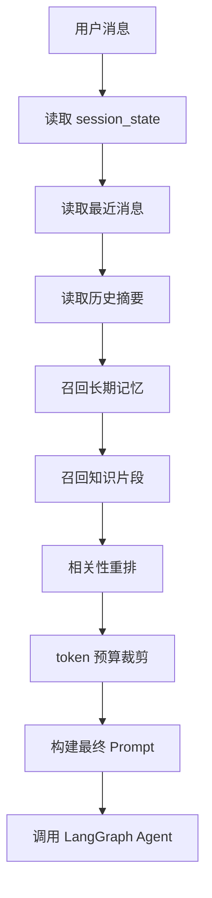

# AiTrader 第二阶段实施方案：长期记忆 + 统一 RAG

## 1. 文档目标

本文档用于指导 `AiTrader` 项目在第一阶段 `消息 + 状态 + 摘要` 完成之后，继续建设第二阶段能力：

- `长期记忆`：让系统跨会话记住用户稳定信息和项目背景
- `统一 RAG`：让知识检索和会话上下文统一进入同一套编排流程

第二阶段的目标不是简单“多加一个向量库”，而是建立一套稳定、可解释、可扩展的 `上下文召回层`。

## 2. 第二阶段要解决什么问题

即使完成了第一阶段，系统仍会遇到以下限制：

- 用户换了会话后，AI 不记得之前稳定偏好
- 普通聊天和知识问答仍是割裂的两套逻辑
- 策略问答缺少长期项目背景和用户画像支撑
- RAG 召回结果与会话上下文没有统一优先级管理
- 检索结果是否相关、是否误召回缺少统一约束

因此第二阶段要补齐两部分：

1. 用户长期记忆层
2. 知识检索统一编排层

## 3. 第二阶段的交付结果

完成本阶段后，系统应具备以下能力：

- 用户在不同会话中仍能保留稳定偏好
- AI 可以记住项目级背景，如用户长期关注加密策略或偏好中文输出
- 普通对话、策略问答、知识检索都走统一上下文组装流程
- 知识片段和长期记忆都可以按相关性召回
- 检索结果可记录、可分析、可优化

## 4. 核心设计思路

### 4.1 五层上下文结构

第二阶段完整上下文建议由五层组成：

- `近期消息层`：最近 6 到 10 条原始消息
- `会话摘要层`：旧消息压缩结果
- `会话状态层`：当前会话任务、步骤和参数
- `长期记忆层`：用户长期偏好、稳定约束、项目背景
- `知识层`：知识库、策略文档、业务规则、交易术语

每次模型调用时，不是“把所有东西都塞进去”，而是：

- 先读状态和近期消息
- 再按相关性召回记忆和知识
- 最后按优先级裁剪并组装

### 4.2 第二阶段的本质

第二阶段不是“加两个表”这么简单，本质上是新增一个 `Context Builder`。

它负责：

- 识别当前请求属于什么场景
- 决定要召回哪些长期记忆
- 决定要召回哪些知识片段
- 给不同上下文分配优先级
- 控制 token 使用

## 5. 为什么要做长期记忆

`summary` 只能解决单个会话的历史压缩，不能解决跨会话记忆问题。

例如用户在上周明确表达过：

- 偏好中文输出
- 喜欢直接给结论
- 更关注加密市场
- 风险偏好偏稳健

这些信息不应该只存在某一段会话里，而应该在新会话时仍能被召回，这就是长期记忆的意义。

## 6. 为什么要做统一 RAG

当前很多项目会把：

- 聊天上下文
- 知识库问答
- Agent 工具结果

分成不同模块分别处理，结果就是回答链路不一致，行为难以预测。

统一 RAG 的目标是：

- 让知识检索成为上下文的一部分
- 让检索结果进入统一排序和裁剪逻辑
- 让普通聊天、策略分析、文档问答都复用同一套上下文入口

## 7. 第二阶段数据模型设计

第二阶段建议新增以下核心表。

### 7.1 `ai_user_memories`

用于保存用户长期记忆。

建议字段：

- `id`
- `user_id`
- `memory_type`
- `content`
- `importance_score`
- `confidence_score`
- `source`
- `is_active`
- `last_used_at`
- `created_at`
- `updated_at`

字段说明：

- `memory_type` 推荐支持 `preference`、`goal`、`constraint`、`profile`、`project_context`
- `importance_score` 用于控制记忆权重
- `confidence_score` 用于标记该记忆可靠程度
- `is_active` 用于处理过期或冲突记忆

示例记录：

```text
用户长期偏好中文回答，倾向简洁且先给结论
```

```text
用户主要关注加密货币策略分析，风险偏好偏稳健
```

### 7.2 `ai_memory_embeddings`

用于保存长期记忆的向量引用。

建议字段：

- `id`
- `memory_id`
- `embedding_ref`
- `embedding_model`
- `created_at`

说明：

- 若当前仍用 Redis 存向量，可把 Redis key 存在 `embedding_ref`
- 若后续切 `Qdrant` 或 `pgvector`，结构可平滑迁移

### 7.3 `ai_knowledge_docs`

用于保存知识文档元信息。

建议字段：

- `id`
- `doc_type`
- `title`
- `source`
- `status`
- `created_at`
- `updated_at`

用途：

- 管理文档来源和状态

### 7.4 `ai_knowledge_chunks`

用于保存知识分片。

建议字段：

- `id`
- `doc_id`
- `chunk_index`
- `chunk_text`
- `keywords`
- `embedding_ref`
- `created_at`

说明：

- `keywords` 有助于规则召回和调试
- `embedding_ref` 用于关联向量数据

### 7.5 `ai_context_logs`

用于记录上下文召回与组装结果。

建议字段：

- `id`
- `conversation_id`
- `user_message_id`
- `scene_type`
- `used_summary_ids`
- `used_memory_ids`
- `used_knowledge_ids`
- `retrieval_score_avg`
- `prompt_token_estimate`
- `trim_action`
- `validation_status`
- `created_at`

这张表是第二阶段的关键配套设施，能帮助你排查：

- 为什么召回错了
- 为什么记忆污染回答
- 为什么知识片段没有被带进去

## 8. 长期记忆的设计原则

### 8.1 什么该存

适合进入长期记忆的内容：

- 用户偏好，例如语言、回答风格、展示偏好
- 稳定的业务背景，例如主要关注的市场和产品方向
- 长期目标，例如正在做量化交易、策略研究
- 稳定约束，例如偏好低风险、偏好中文、关注实操建议

### 8.2 什么不该存

不适合进入长期记忆的内容：

- 一次性聊天内容
- 用户未明确确认的信息
- 容易快速过期的事实
- 明显只在当前会话有效的信息

### 8.3 长期记忆与 `session_state` 的区别

`session_state`

- 当前会话内有效
- 强依赖当前任务进度
- 经常变化

`长期记忆`

- 跨会话可复用
- 偏用户画像和稳定偏好
- 更新频率更低

举例：

- “本次选择 BTC、中线、稳健” 属于 `session_state`
- “用户长期偏好稳健风格分析” 属于 `长期记忆`

## 9. 长期记忆的写入流程

### 9.1 触发时机

建议在以下时机尝试提取长期记忆：

- 单轮对话完成后
- 会话结束时
- 用户明确表达偏好、身份或长期目标时
- 用户纠正系统行为时

### 9.2 提取逻辑

推荐流程：

1. 读取本轮用户消息和 AI 回复
2. 用规则或模型判断是否包含长期信息
3. 对候选记忆做去重和冲突检查
4. 写入 `ai_user_memories`
5. 生成 embedding 并建立索引

### 9.3 记忆写入规则

建议先从规则和白名单字段开始：

- 语言偏好
- 输出风格
- 市场偏好
- 风险偏好
- 长期项目方向

后续再用模型抽取复杂记忆。

### 9.4 去重和冲突处理

长期记忆必须处理冲突，否则容易污染回答。

示例：

- 旧记忆：用户偏好高风险
- 新输入：以后都按稳健风格回答

处理方式：

- 将旧记忆标记为 `is_active = false`
- 写入新记忆
- 更新相关 embedding

## 10. 长期记忆的召回流程

### 10.1 召回目标

召回不是越多越好，而是找到最相关的少量记忆进入 prompt。

### 10.2 推荐流程

1. 根据当前用户输入生成查询 embedding
2. 在 `ai_user_memories` 中先按 `user_id` 过滤
3. 做相似度召回
4. 再根据 `importance_score` 做重排
5. 取前 3 到 5 条进入上下文

### 10.3 召回时的附加规则

建议额外叠加规则：

- 优先召回 `is_active = true`
- 优先召回最近被使用过的高价值记忆
- 对低置信度记忆降权
- 对已与当前会话状态冲突的记忆直接过滤

## 11. 知识库与统一 RAG 的具体做法

### 11.1 知识来源

适合纳入知识库的内容：

- 平台说明文档
- 策略分析模板
- 交易术语解释
- KYC、风控、业务规则
- 行情分析文档和研究材料

### 11.2 文档处理流程

建议流程：

1. 上传文档
2. 提取纯文本
3. 文本切片
4. 生成 embedding
5. 保存文档元信息和切片
6. 建立向量索引

### 11.3 切片建议

切片策略建议：

- 每片 300 到 800 字符
- 邻片保留适当重叠
- 尽量按语义段落切分，而不是硬截断

### 11.4 第一阶段到第二阶段的衔接

如果第一阶段已经有：

- `messages`
- `session_state`
- `summaries`

那么第二阶段只是在上下文组装时增加：

- `memories`
- `knowledge_chunks`

上下文组装顺序升级为：

1. 系统提示词
2. `session_state`
3. 最近消息
4. 历史摘要
5. 长期记忆
6. 知识片段
7. 当前用户输入

## 12. 统一 Context Builder 设计

### 12.1 它的职责

`Context Builder` 建议放在 Java 后端或 Python 侧的单独模块中，用来统一调度上下文组装。

职责包括：

- 读取最近消息
- 读取状态
- 读取摘要
- 召回长期记忆
- 召回知识片段
- 按场景进行重排和裁剪
- 输出最终模型输入

### 12.2 推荐处理流程



### 12.3 不同场景的召回策略

普通聊天：

- 最近消息优先
- 长期记忆数量少量注入
- 知识召回按需触发

策略分析：

- `session_state` 优先级最高
- 可召回策略知识模板
- 长期记忆用于补足用户风险偏好和市场偏好

知识问答：

- 知识片段优先
- 最近消息用于理解上下文
- 长期记忆只保留少量风格类信息

## 13. 技术选型建议

### 13.1 存储选型

结合当前项目现状，推荐第二阶段仍采用渐进式方案。

建议如下：

- 关系数据：继续使用 `MySQL`
- 缓存与轻量索引：继续使用 `Redis`
- 向量能力：
  - 第一版：优先尝试 Redis 方案
  - 第二版：若规模增长明显，再评估 `Qdrant`

### 13.2 为什么不建议现在重构数据库

当前项目后端主业务明显围绕 `MySQL + MyBatis` 构建，如果此时切换主数据库：

- 会打断当前后端开发节奏
- 会让 AI 方案和主业务栈脱节
- 会增加部署复杂度

因此推荐：

- 业务结构数据继续在 MySQL
- 向量数据先轻量接入
- 等知识量和召回复杂度足够大时再升级

## 14. Java 后端实现建议

### 14.1 Java 侧职责

Java 后端建议继续作为统一会话和上下文网关，新增以下职责：

- 管理长期记忆元数据
- 管理知识文档和切片元数据
- 统一触发召回流程
- 记录 `ai_context_logs`

### 14.2 建议新增服务

- `AiMemoryService`
- `AiKnowledgeService`
- `AiContextBuilderService`
- `AiContextLogService`

### 14.3 建议接口

`POST /api/ai/knowledge/upload`

- 上传知识文档

`GET /api/ai/memories`

- 查询当前用户长期记忆

`POST /api/ai/memories/rebuild`

- 重新生成记忆索引

`POST /api/ai/conversations/{id}/chat`

- 继续作为统一聊天入口，但内部接入记忆和知识召回

## 15. Python Agent 实现建议

### 15.1 Python 侧职责

Python Agent 建议负责：

- 文档切片
- embedding 生成
- 记忆提取
- 知识召回
- 摘要与答案生成

### 15.2 推荐新增能力

建议在现有 `ai-agent-service` 中补充：

- `memory_service.py`
- `context_builder.py`
- `reranker.py`

### 15.3 输入协议建议

建议 Java 调用 Python 时，传入结构升级为：

```json
{
  "message": "继续按稳健风格分析 BTC",
  "user_id": "123",
  "session_id": "conversation_1001",
  "history": [],
  "state": {},
  "summaries": [],
  "memories": [
    "用户长期偏好中文简洁回答",
    "用户主要关注加密货币策略分析"
  ],
  "knowledge_chunks": [
    "BTC 波段策略中，风险控制应优先考虑止损与仓位管理。"
  ]
}
```

### 15.4 输出协议建议

建议 Python 输出包含：

- `answer`
- `state_patch`
- `memory_candidates`
- `retrieval_debug`

这样 Java 可以决定是否写入新记忆与日志。

## 16. 统一 RAG 的验收标准

第二阶段完成后，至少应满足：

- 新会话中可召回用户稳定偏好
- 知识问答不再单独走割裂接口逻辑
- 策略分析中能同时利用状态、记忆和知识
- 召回结果有日志记录
- 误召回和冲突记忆可排查

## 17. 风险与控制策略

### 17.1 常见风险

- 记忆写入过多，导致回答被历史偏见污染
- 知识召回不准，导致答非所问
- token 被知识片段挤满，反而丢掉当前问题重点
- 旧记忆和当前状态冲突

### 17.2 控制策略

- 长期记忆只存高价值、稳定信息
- 每次仅召回少量最相关内容
- `session_state` 优先级始终高于长期记忆
- 通过 `ai_context_logs` 记录召回和裁剪结果
- 对冲突记忆增加失效机制

## 18. 推荐实施顺序

第二阶段建议按以下顺序推进：

1. 新增长期记忆表和知识表
2. 接入文档切片与 embedding 生成
3. 实现长期记忆写入和召回
4. 实现知识召回
5. 实现统一 `Context Builder`
6. 增加 `ai_context_logs`
7. 调整不同场景下的召回权重

## 19. 典型伪代码

```ts
async function buildContext(conversationId: number, userId: number, message: string) {
  const state = await getSessionState(conversationId);
  const recentMessages = await getRecentMessages(conversationId, 8);
  const summaries = await getLatestSummaries(conversationId, 1);
  const memories = await searchUserMemories(userId, message, 5);
  const knowledgeChunks = await searchKnowledge(message, 5);

  const ranked = rerankContext({
    state,
    recentMessages,
    summaries,
    memories,
    knowledgeChunks
  });

  return trimByTokenBudget(ranked, 12000);
}
```

## 20. 最终建议

对于 `AiTrader` 项目，第二阶段的重点不是“堆功能”，而是让：

- `长期记忆` 真正跨会话可用
- `知识检索` 真正和会话上下文统一
- `上下文组装` 真正可解释、可调试

建议你采用渐进式路线：

- 先把长期记忆做少、做准
- 再把知识库接入统一入口
- 最后通过日志和权重调优逐步提升效果

这样系统不会一下变得过重，但会持续变强。
